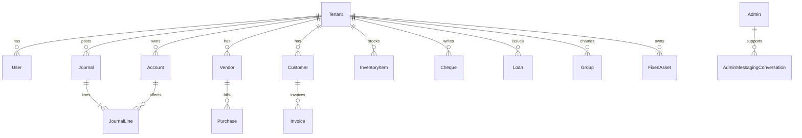

# 04 — Database Schema

**Source of truth:** `backend/prisma/schema.prisma`  
**Database:** PostgreSQL  
**ORM:** Prisma

All tenant-scoped models typically cascade on `Tenant` delete.

---

## 1. Tenancy & users

### `Tenant`

| Field | Notes |
|-------|--------|
| `id`, `name` (unique), `slug` (unique) | Identity |
| `tenantType` | `FAMILY` \| `BUSINESS` |
| `metadata` | JSON — business onboarding, industry, KRA, invoice style, etc. |
| `ownerEmail` | Optional |

Owns nearly all domain collections (accounts, journals, vendors, invoices, inventory, groups, …).

### `User`

| Field | Notes |
|-------|--------|
| `tenantId` | Optional FK (platform edge cases) |
| `email`, `password` (bcrypt), `name` | Auth |
| `role` | `OWNER \| ADMIN \| PARENT \| CHILD \| MEMBER \| SUPER_ADMIN` |
| `permissions` | JSON for fine-grained family permissions |
| `otp`, OTP expiry fields | Password reset |
| `lastSeenAt` | Presence heartbeat |
| `auth0Id` | Legacy / unused pathway |
| `profileImage` / avatar paths | Uploads |

### `Admin` (platform)

Separate from `User`. Fields include name, email, password, phone, organization, `isSuperAdmin`. Used for `/api/admin/*` JWT (`isAdmin: true`).

---

## 2. Double-entry spine

```
Tenant
  └── Account (Chart of Accounts)
        └── JournalLine ←──── Journal
```

### `Account`

| Important fields | Purpose |
|------------------|---------|
| `code`, `name`, `type` | `ASSET \| LIABILITY \| EQUITY \| INCOME \| EXPENSE` |
| `subtype`, `systemTag` | Reliable lookups (`CASH`, `BANK`, `AR`, `AP`, `MPESA`, …) |
| `isControl`, `allowDirectPost` | Control accounts (AR/AP) |
| `isPaymentEligible` | Cash/Bank only for payment pickers |
| `isSystem`, `isContra`, `isActive` | Lifecycle |
| `parentId` | Hierarchy |
| `currency` | Default `KES` |
| `detailType`, `metadata` | Filtering / bank or loan meta |
| Unique | `(tenantId, code)` |

### `PaymentAccount`

Operational registry for cash/bank accounts: institution, account number, opening balance, reconcile flag, status.

### `Journal` / `JournalLine`

| Journal | JournalLine |
|---------|-------------|
| `tenantId`, `date`, `reference`, `description`, `status` | `journalId`, `accountId`, `debit`, `credit`, `memo` |
| Status enum includes posted/draft-style values | Lines must balance |

Money events across sales, purchases, bank, transfers, assets, loans, cheque clear create journals.

### `JournalStatus`

See schema for exact enum values (e.g. posted vs draft).

---

## 3. Family finance

| Model | Role |
|-------|------|
| `Transaction` | High-level income/expense/transfer events (`TransactionType` enum) |
| `Category` | Income/expense categories (icon/color) |
| `PaymentMethod` | Cash, M-Pesa, bank, etc. |
| `Goal` / `GoalStatus` | Savings goals + progress |
| `Budget` | Category budgets |
| `RecurringTransaction` | Recurring templates |
| `Group` | Chama / savings group |
| `GroupMember` | Membership + `GroupMemberRole` |
| `GroupContribution` | Contributions + status |

Group enums: `GroupType`, `GroupStatus`, `GroupContributionStatus`.

---

## 4. Accounts payable (vendors & purchases)

```
Vendor ─── Purchase ─── PurchaseItem
              └── PurchasePayment
VendorTag, VendorStats
```

| Model | Notes |
|-------|--------|
| `Vendor` | Supplier master; logo, tax id, payment terms, tags |
| `Purchase` | Bill header; `PurchaseStatus` |
| `PurchaseItem` | Line: qty, price, optional `accountId` / `inventoryItemId` |
| `PurchasePayment` | Payment against bill + bank account |

---

## 5. Accounts receivable (customers & invoices)

```
Customer ─── Invoice ─── InvoiceItem
                └── InvoicePayment
Receipt, Expense, ExpenseCategory
```

| Model | Notes |
|-------|--------|
| `Customer` | AR party; address, contacts, business type, analytics helpers |
| `Invoice` | Sales invoice; `InvoiceStatus` |
| `InvoiceItem` | Lines with optional inventory linkage |
| `InvoicePayment` | Cash/bank application |
| `Receipt` | Receipt documents |
| `Expense` / `ExpenseCategory` | Business expenses tied to accounts |

---

## 6. Inventory

| Model | Role |
|-------|------|
| `ItemType` | Classification |
| `InventoryItem` | SKU, costs, selling price, qty on hand, WAC fields, linked asset/cogs/income accounts |
| `StockMovement` | Movement ledger (`MovementType`, `MovementReason`) |
| `InventoryValuation` | Valuation snapshots |

`ProductType` enum supports inventory product kinds.

---

## 7. Banking, cheques, transfers

| Model | Role |
|-------|------|
| `BankTransaction` | Deposits, cheques, transfers; `BankTransactionType`, `BankStatus` |
| `Cheque` | Cheque registry; `ChequeStatus` (pending/cleared/void, …) |
| `Transfer` | CoA asset↔asset transfer (+ optional fee) |

---

## 8. Fixed assets & lending

### `FixedAsset` / `AssetDepreciation`

Tracks purchase, financing portions, warranty, depreciation settings, links to multiple CoA accounts (asset, paid-from, finance, accum dep, dep expense, disposal). Status via `AssetStatus`.

### `Loan` / `LoanTransaction`

Informal lending: borrower, amount, due date, paid-from / deposited-to accounts, issue/repay/write-off history.

---

## 9. Tax

### `VatRate`

Per-tenant rates (`name`, `rate`, `code`, `isActive`). Kenyan-oriented seeds (e.g. 16%).

---

## 10. Platform / admin

| Model | Role |
|-------|------|
| `AdminMessagingConversation` | Support inbox threads |
| `AdminMessagingMessage` | Messages; `MessagingSenderRole` |
| `PlatformTrafficDay` | Analytics traffic series |
| `PlatformReferrerDay` | Referrers |
| `PlatformDeviceShare` | Device mix |
| `AdminTask` | Internal task board |

---

## 11. Entity relationship (conceptual)



---

## 12. Migrations & seeding

| Path / script | Purpose |
|---------------|---------|
| `backend/prisma/migrations/` | Schema history |
| `npx prisma migrate deploy` | Apply in deploy |
| `npm run db:init` | `scripts/initDb.js` |
| `npm run seed` | `prisma/seed.js` |
| `npm run seed:assets` … `seed:expenses` | CoA segment seeds |
| `npm run seed:suppliers` | Kenyan suppliers |
| `npm run seed:dashboard` | Admin dashboard analytics seed |

Registration also seeds CoA / categories / VAT / suppliers / item types for **new** tenants.

---

## 13. Working with the schema

```bash
cd backend
npx prisma studio          # GUI browse
npx prisma migrate dev     # Dev migrate
npx prisma generate        # Regenerate client after schema edits
```

When adding domain features: add Prisma models → migrate → mount routes in `app.js` → extend `FRONTEND/services/api.ts` → add screens under `FRONTEND/app/`.
